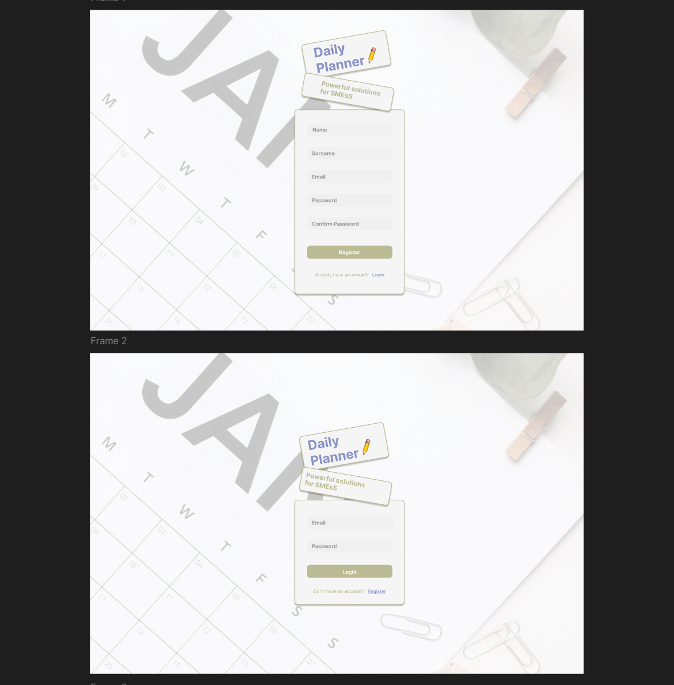

# DAILY PLANNER 📆

Daily Planner is an application designed for professionals who need to efficiently manage their appointment schedules. This tool not only allows you to schedule and organize appointments with clients but also maintain a detailed database of each one, including their history and specific treatments.

## Functional

### Use Cases

Provider

- Create client
- Delete client
- Edit client
- Make an appointment
- Delete appointment
- Edit appointment
- Create service
- Delete service
- Edit service
- Create notes (version 1.0.0)
- Delete notes (version 1.0.0)
- Edit notes (version 1.0.0)
- Edit profile (version 1.0.0)
- Configure app (version 1.0.0)
- Send mails (remainders, info, etc...) (version 1.0.0)
- Retrive every stats for date, time, customer, etc... (version 1.0.0)

### UI Design

## Technical

### Data Model

User

- id (auto)
- name (string)
- surname (string)
- email (string)
- password (string)
- role (string, enum: customer|provider)
- phone (string, optional)
- manager (User.id)
- active (boolean)
- providers (User.id)

Service

- id (auto)
- name (string)
- duration (number)
- price (number)
- description (string)
- provider (User.id)
- active (boolean)

Appointment

- id (auto)
- service (Service.id)
- stardate (Date)
- enddate (Date)
- customer (User.id)
- provider (User.id)

Note

- id (auto)
- text (string)
- createdat (Date)
- createdby (User.id)
- relatedto(objectid)
- relatedmodel (string, enum: appointment|customer|service)

## Test-Coverage

